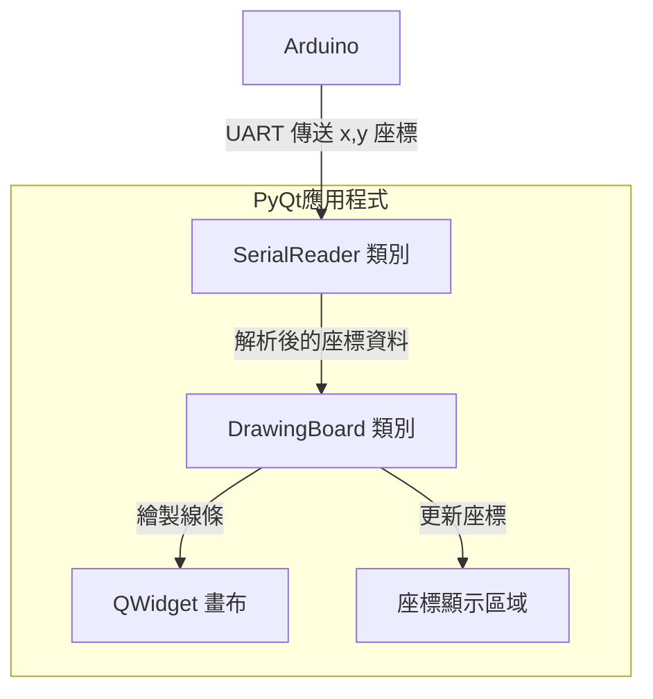

# 畫板應用程式設計文件

## 系統架構

## 技術規格

### 畫布設定
- 預設大小：800x600 像素
- 背景顏色：白色
- 可縮放：否

### 畫筆設定
- 顏色選擇器：支援 RGB 顏色選擇
- 筆刷粗細：可調整範圍 1-20 像素
- 預設設定：
  - 顏色：黑色
  - 粗細：2 像素

### 串口設定
- 通訊協議：UART
- 預設鮑率：9600 (可選：9600, 19200, 38400, 115200)
- 資料格式：ASCII 字串，"x,y" 格式

## 主要元件說明

### 1. SerialReader 類別
- 負責 UART 通訊
- 監聽並接收 Arduino 發送的座標資料
- 解析 "x,y" 格式的字串為數值
- 使用信號機制通知新座標到達

### 2. DrawingBoard 類別
- 繼承自 QWidget
- 管理繪圖狀態和歷史座標
- 處理座標轉換和線條繪製
- 更新座標顯示區域

### 3. 座標顯示區域
- 使用 QLabel 顯示當前座標
- 即時更新 x,y 數值

## 資料流程
1. Arduino 透過 UART 發送 "x,y" 格式的座標
2. SerialReader 接收並解析座標
3. DrawingBoard 接收解析後的座標
4. 在畫布上繪製線條
5. 更新座標顯示區域

## 錯誤處理機制
- UART 連接異常處理
- 資料格式錯誤處理
- 座標範圍檢查
- 繪圖異常處理